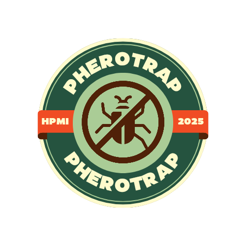

<p align="center">
  
</p>

# 🌾 Smart Pherotrap
### Sistem Perangkap Feromon Terpadu Berbasis IoT untuk Pengendalian Hama Wereng pada Tanaman Padi

[]()
[]()
[]()
[]()

> Project ini dikembangkan sebagai bagian dari **Hibah Penelitian Mahasiswa Institut Teknologi Sumatera (ITERA)** dan **Tugas Besar Mata Kuliah IoT**, Program Studi Teknik Telekomunikasi, Fakultas Teknologi Industri (FTI) ITERA.

---

## 📋 Daftar Isi

1. [Ringkasan Project](#-ringkasan-project)
2. [Arsitektur Sistem](#-arsitektur-sistem)
3. [Fitur Utama](#-fitur-utama)
4. [Komponen Hardware](#-komponen-hardware)
5. [Stack Software](#-stack-software)
6. [Struktur Repository](#-struktur-repository)
7. [Instalasi](#-instalasi)
8. [Konfigurasi](#-konfigurasi)
9. [Deployment](#-deployment)
10. [Cara Kerja Sistem (Alur Data)](#-cara-kerja-sistem-alur-data)
11. [Troubleshooting](#-troubleshooting)
12. [Roadmap Pengembangan Lanjutan](#-roadmap-pengembangan-lanjutan)
13. [Kontributor](#-kontributor)
14. [Lisensi](#-lisensi)

---

## 🧭 Ringkasan Project

**Smart Pherotrap** adalah sistem perangkap feromon pintar berbasis IoT yang dirancang untuk mendeteksi dan memantau populasi hama wereng batang coklat (*Nilaparvata lugens*) pada tanaman padi secara real-time. Sistem ini menggabungkan:

- **Computer Vision (YOLOv11)** untuk deteksi dan penghitungan wereng dari citra kamera
- **Multi-stage filtering** (Temporal Consistency Filter + Kalman Filter) untuk menstabilkan hasil hitungan dari noise deteksi
- **ESP32-CAM** sebagai unit capture citra di lapangan
- **ESP32 (dual-core FreeRTOS)** sebagai unit kontrol sensor lingkungan (suhu/kelembaban) dan aktuator (lampu perangkap)
- **MQTT (HiveMQ Cloud)** sebagai backbone komunikasi antar perangkat
- **Google Sheets** sebagai media logging data historis
- **Cloudflare Tunnel + GitHub Gist** sebagai mekanisme expose server lokal ke internet secara dinamis tanpa IP publik tetap

Tujuan sistem: membantu petani memantau tingkat serangan hama wereng secara otomatis, mengontrol lampu perangkap feromon berbasis jadwal maupun override manual, serta menyediakan data historis untuk analisis pola serangan hama.

---

## 🏗️ Arsitektur Sistem

```
┌─────────────────┐        HTTP POST (JPEG)         ┌───────────────────────┐
│   ESP32-CAM     │ ──────────────────────────────▶│   Flask Server        │
│  (Capture Foto) │                                 │    (server.py)        │
│                 │◀──── GET server URL (Gist) ─── │  - Terima gambar      │
└─────────────────┘                                 │  - Simpan ke /uploads │
                                                    └──────────┬────────────┘
                                                                 │ baca file terbaru
                                                                 ▼
                                                      ┌───────────────────────┐
                                                      │   kalyol.py           │
                                                      │  (YOLO Detection)     │
                                                      │  - Preprocessing      │
                                                      │  - Inference YOLOv11  │
                                                      │  - Temporal Filter    │
                                                      │  - Kalman Filter      │
                                                      │  - Visualisasi CV2    │
                                                      └──────────┬────────────┘
                                                                 │ publish MQTT
                                                                 ▼
                                              ┌────────────────────────────────┐
                                              │   MQTT Broker (HiveMQ Cloud)   │
                                              │   Topic: /pest                 │
                                              │   Topic: /temperature          │
                                              │   Topic: /humidity             │
                                              │   Topic: /lampu                │
                                              └───────────────┬────────────────┘
                                                              │ subscribe
                                                              ▼
                                              ┌────────────────────────────────┐
                                              │   ESP32 (Node Utama)           │
                                              │  - Baca sensor DHT22           │
                                              │  - Kontrol relay lampu         │
                                              │    (jadwal / FORCE override)   │
                                              │  - Tampilkan status di LCD     │
                                              │  - Kirim data ke Google Sheets │
                                              └────────────────────────────────┘
```

**Ringkasan alur:** ESP32-CAM mengambil foto perangkap → upload ke server Flask lokal (di-tunnel via Cloudflare, URL-nya disimpan & dibaca lewat GitHub Gist) → `kalyol.py` mengambil gambar terbaru, mendeteksi wereng dengan YOLOv11, menstabilkan hasil hitungan dengan filter bertingkat → hasil dipublish ke MQTT → ESP32 node utama menerima jumlah wereng, membaca suhu/kelembaban, mengontrol relay lampu perangkap, menampilkan status di LCD, dan mengirim seluruh data ke Google Sheets untuk pencatatan historis.

---

## ✨ Fitur Utama

- **Deteksi wereng otomatis** menggunakan model YOLOv11 custom-trained (`yolo11pherox`)
- **Triple-stage filtering** (Raw → Temporal Consistency → Kalman Filter dengan outlier rejection) untuk hasil hitungan yang stabil dan tidak "lompat-lompat" akibat noise deteksi
- **Preprocessing citra otomatis**: CLAHE (contrast enhancement), denoising, sharpening sebelum inference
- **Visualisasi real-time**: window deteksi (bounding box) dan grafik tren jumlah wereng (raw vs filtered) menggunakan OpenCV
- **Kontrol lampu perangkap otomatis berbasis jadwal** (ON 17:00–07:00, OFF 07:00–17:00) dengan **mode FORCE override** via MQTT untuk kontrol manual
- **Monitoring suhu & kelembaban** menggunakan sensor DHT22
- **Tampilan status lokal** di LCD 16x2 (I2C)
- **Auto-reconnect WiFi & MQTT** dengan retry logic
- **Sinkronisasi waktu NTP** otomatis dengan re-sync berkala
- **Logging data historis otomatis ke Google Sheets** (timestamp, suhu, kelembaban, jumlah wereng, status relay, RSSI, mode)
- **Dynamic tunneling**: server Flask lokal di-expose ke internet secara otomatis menggunakan Cloudflare Tunnel, URL publik disimpan otomatis ke GitHub Gist sehingga ESP32-CAM selalu tahu alamat server terbaru tanpa IP statis
- **Multi-tasking non-blocking** di ESP32 menggunakan FreeRTOS (6 task paralel: sync time, baca sensor, kontrol relay, tampilan LCD, MQTT, logging Google Sheets)

---

## 🔧 Komponen Hardware

| Komponen | Fungsi | Keterangan |
|---|---|---|
| ESP32-CAM (AI Thinker) | Capture citra perangkap | Modul kamera OV2640 |
| ESP32 DevKit (dual-core) | Node kontrol utama | Menjalankan 6 task FreeRTOS paralel |
| Sensor DHT22 | Baca suhu & kelembaban | Pin `GPIO 32` |
| Modul Relay | Kontrol lampu perangkap feromon | Pin `GPIO 23` |
| LCD 16x2 I2C | Tampilan status lokal | Alamat I2C `0x27` |
| Perangkap feromon fisik | Media perangkap wereng | Dipasang di lahan sawah |
| PC/Server lokal (mini PC/laptop) | Menjalankan Flask server & YOLO inference | Perlu GPU/CPU untuk inference |

---

## 💻 Stack Software

**Firmware (ESP32):**
- Arduino Framework (ESP-IDF)
- Library: `WiFi.h`, `HTTPClient.h`, `ESPAsyncWebServer`, `esp_camera.h`, `PubSubClient`, `WiFiClientSecure`, `DHT`, `LiquidCrystal_I2C`

**Backend/AI (Python):**
- Flask (server penerima upload gambar)
- Ultralytics YOLO (YOLOv11) untuk deteksi objek
- OpenCV (`cv2`) untuk preprocessing & visualisasi
- `paho-mqtt` untuk komunikasi MQTT
- NumPy untuk pemrosesan numerik (Kalman Filter, Temporal Filter)

**Infrastruktur:**
- HiveMQ Cloud (MQTT broker, TLS port 8883)
- Cloudflare Tunnel (`cloudflared`) untuk expose server lokal
- GitHub Gist API untuk menyimpan & mendistribusikan URL server terkini
- Google Apps Script + Google Sheets untuk logging data

---

## 📁 Struktur Repository

```
smart-pherotrap/
├── ESP32-CAM.ino          # Firmware untuk modul capture kamera
├── ESP32.ino              # Firmware node utama (sensor, relay, LCD, MQTT, Google Sheets)
├── server.py              # Flask server penerima upload gambar dari ESP32-CAM
├── kalyol.py              # Pipeline deteksi YOLO + filtering + visualisasi + publish MQTT
├── run_kalyol.sh           # Script menjalankan kalyol.py di virtual environment
├── run_all.sh              # Script bash: setup venv, jalankan Flask + Cloudflare Tunnel, update Gist
├── run_all.py               # Alternatif Python untuk menjalankan Flask + Cloudflare Tunnel + update Gist
├── uploads/                # (auto-generated) folder penyimpanan gambar dari ESP32-CAM
├── YOLO/
│   └── runs/train/yolo11pherox/weights/best.pt   # Model YOLO hasil training (perlu disiapkan terpisah)
└── README.md               # Dokumentasi ini
```

> ⚠️ **Catatan penting:** File model (`best.pt`) tidak disertakan langsung di repo ini karena ukurannya besar. Model harus ditraining ulang atau diunduh terpisah, lalu diletakkan sesuai path di `Config.MODEL_PATH` pada `kalyol.py`.

---

## 🚀 Instalasi

### 1. Prasyarat

Pastikan sudah terinstall di server/mini PC:

- Python 3.9 atau lebih baru
- `pip`
- `cloudflared` (Cloudflare Tunnel CLI) — [panduan instalasi resmi](https://developers.cloudflare.com/cloudflare-one/connections/connect-networks/downloads/)
- Arduino IDE atau PlatformIO (untuk flashing firmware ESP32)
- Git

### 2. Clone Repository

```bash
git clone <URL_REPOSITORY_INI>
cd smart-pherotrap
```

### 3. Setup Server Python (Flask + YOLO)

```bash
# Buat virtual environment
python3 -m venv venv
source venv/bin/activate   # Linux/Mac
# venv\Scripts\activate    # Windows

# Install dependency utama
pip install flask requests
pip install opencv-python numpy paho-mqtt ultralytics
```

> 💡 Jika server tidak punya GPU, pastikan parameter `device="cpu"` pada `kalyol.py` (baris konfigurasi `self.model.predict(...)`) tetap `"cpu"`. Jika tersedia GPU NVIDIA + CUDA, ganti ke `device="cuda"` atau `device=0` untuk mempercepat inference secara signifikan.

### 4. Siapkan Model YOLO

- Letakkan file model hasil training (`best.pt`) pada path:
  ```
  YOLO/runs/train/yolo11pherox/weights/best.pt
  ```
- Jika belum punya model, lakukan training menggunakan dataset citra wereng dengan Ultralytics YOLOv11 (`yolo11n.pt` atau varian lain sebagai base model), lalu sesuaikan `MODEL_PATH` di `kalyol.py`.

### 5. Setup Firmware ESP32

1. Buka **Arduino IDE**, install board package **ESP32 by Espressif Systems** via Board Manager.
2. Install library berikut via Library Manager:
   - `PubSubClient`
   - `DHT sensor library` (Adafruit)
   - `Adafruit Unified Sensor`
   - `LiquidCrystal I2C`
   - `ESPAsyncWebServer` + `AsyncTCP` (untuk `ESP32-CAM.ino`)
3. Untuk **ESP32-CAM.ino**: pilih board `AI Thinker ESP32-CAM`.
4. Untuk **ESP32.ino**: pilih board sesuai modul ESP32 DevKit yang digunakan (misal `ESP32 Dev Module`).

---

## ⚙️ Konfigurasi

Sebelum deploy, beberapa nilai `"XXX"` di source code **wajib diganti** dengan kredensial masing-masing:

### `ESP32-CAM.ino`
```cpp
const char* ssid = "XXX";        // Nama WiFi
const char* password = "XXX";    // Password WiFi
const char* gist_url = "XXX";    // Raw URL dari GitHub Gist (lihat langkah Gist di bawah)
```

### `ESP32.ino`
```cpp
const char* ssid = "XXX";
const char* password = "XXX";
const char* mqttServer = "XXX";       // Host broker HiveMQ Cloud
const char* mqttUser = "XXX";
const char* mqttPassword = "XXX";
const char* GOOGLE_SCRIPT_URL = "XXX"; // URL Web App Google Apps Script
```

### `run_all.sh` / `run_all.py`
```bash
GIST_ID="XXX"          # ID Gist (bukan URL penuh)
GITHUB_TOKEN="XXX"     # Personal Access Token dengan scope "gist"
```

### Langkah membuat GitHub Gist untuk distribusi URL server

1. Buat Gist baru (bisa secret) berisi 1 file bernama `esp_server_url.txt`, isi awal bebas (misal `http://localhost:5000`).
2. Ambil `GIST_ID` dari URL Gist (`https://gist.github.com/<username>/<GIST_ID>`).
3. Buat **Personal Access Token** di GitHub dengan scope `gist`, lalu isi ke `GITHUB_TOKEN`.
4. Ambil **raw URL** dari file Gist tersebut, isi ke variabel `gist_url` di `ESP32-CAM.ino`.

### Langkah setup HiveMQ Cloud (MQTT)

1. Buat akun gratis di [HiveMQ Cloud](https://www.hivemq.com/mqtt-cloud-broker/).
2. Buat cluster, catat **Host**, **Port (8883, TLS)**, buat **username/password**.
3. Isi ke `Config.BROKER`, `Config.PORT`, `Config.USERNAME`, `Config.PASSWORD` di `kalyol.py`, serta ke `mqttServer`, `mqttPort`, `mqttUser`, `mqttPassword` di `ESP32.ino`.

### Langkah setup Google Sheets Logging

1. Buat Google Spreadsheet baru.
2. Buka **Extensions → Apps Script**, buat Web App yang menerima POST JSON (`timestamp`, `temperature`, `humidity`, `wereng`, `relay`, `rssi`, `mode`, `notes`) dan menuliskannya sebagai baris baru di sheet.
3. Deploy sebagai **Web App**, akses "Anyone", salin URL deployment ke `GOOGLE_SCRIPT_URL`.

---

## 📦 Deployment

### A. Menjalankan Server + Tunnel (Otomatis)

Gunakan salah satu script berikut di server/mini PC lapangan:

**Opsi Bash:**
```bash
chmod +x run_all.sh
./run_all.sh
```

**Opsi Python:**
```bash
source venv/bin/activate
python run_all.py
```

Kedua script ini akan otomatis:
1. Membuat virtual environment jika belum ada (khusus `run_all.sh`)
2. Menginstall dependency
3. Menjalankan `server.py` (Flask) di background
4. Menjalankan `cloudflared tunnel` untuk expose server ke internet
5. Mengambil URL publik (`*.trycloudflare.com`) dari log `cloudflared`
6. Mengupdate isi Gist (`esp_server_url.txt`) dengan URL terbaru
7. Menampilkan log gabungan Flask + Cloudflare secara real-time

> ⚠️ **Catatan:** Free tier `trycloudflare.com` menghasilkan URL baru setiap kali server dijalankan ulang. Karena itu mekanisme Gist sangat penting — ESP32-CAM akan selalu fetch URL terbaru dari Gist sebelum upload foto, sehingga tidak perlu re-flash firmware setiap kali URL berubah.

### B. Menjalankan Pipeline Deteksi YOLO

Di terminal terpisah (setelah server aktif dan folder `uploads/` mulai terisi gambar):

```bash
chmod +x run_kalyol.sh
./run_kalyol.sh
```

Script ini akan mengaktifkan virtual environment dan menjalankan `kalyol.py`, yang akan:
- Memantau folder `uploads/` untuk gambar terbaru
- Menjalankan deteksi YOLO + filtering
- Menampilkan 2 window OpenCV: hasil deteksi (bounding box) dan grafik tren jumlah wereng
- Mempublish hasil hitungan ke topic MQTT `/pest`

Tekan `q` pada window OpenCV untuk menghentikan proses deteksi.

### C. Flashing Firmware ke Perangkat

1. Sambungkan ESP32-CAM ke komputer via programmer FTDI (ESP32-CAM tidak punya port USB langsung).
2. Upload `ESP32-CAM.ino`, lalu lepas dari mode flashing dan reset.
3. Sambungkan ESP32 node utama, upload `ESP32.ino`.
4. Pastikan hardware (DHT22, relay, LCD I2C) sudah terpasang sesuai pin yang didefinisikan di kode sebelum menyalakan sistem.

### D. Menjalankan Sistem Secara Berkelanjutan (Disarankan untuk Produksi)

Untuk penggunaan jangka panjang di lapangan, disarankan menjalankan `run_all.sh` dan `run_kalyol.sh` sebagai **systemd service** agar otomatis restart jika crash atau server reboot. Contoh dasar unit file (silakan sesuaikan path):

```ini
[Unit]
Description=Smart Pherotrap Server
After=network.target

[Service]
WorkingDirectory=/home/xxx/esp_server
ExecStart=/home/xxx/esp_server/run_all.sh
Restart=always
User=xxx

[Install]
WantedBy=multi-user.target
```

Simpan sebagai `/etc/systemd/system/pherotrap.service`, lalu:
```bash
sudo systemctl daemon-reload
sudo systemctl enable pherotrap.service
sudo systemctl start pherotrap.service
```

---

## 🔄 Cara Kerja Sistem (Alur Data)

1. **Capture**: ESP32-CAM fetch URL server terbaru dari Gist → ambil foto perangkap → upload via HTTP POST ke endpoint `/upload`.
2. **Penyimpanan**: `server.py` menerima gambar, menyimpannya di folder `uploads/`, dan menghapus file lama jika jumlah file melebihi `MAX_FILES` (default 1, hanya menyimpan gambar terbaru).
3. **Deteksi**: `kalyol.py` membaca gambar terbaru dari `uploads/`, melakukan preprocessing (CLAHE, denoising, sharpening), lalu menjalankan inference YOLOv11.
4. **Filtering**: Hasil hitungan mentah (`raw_count`) diproses melalui:
   - **Temporal Consistency Filter** (median + weighted average dari 5 frame terakhir)
   - **Kalman Filter** dengan outlier rejection (3-sigma rule) dan adaptive noise tuning
   - **Smart rounding** yang membandingkan hasil Kalman dengan tren historis untuk keputusan akhir
5. **Publish**: Jumlah wereng hasil filtering dipublish ke topic MQTT `/pest`.
6. **Distribusi**: ESP32 node utama subscribe ke `/pest`, memperbarui `sysData.werengCount` secara thread-safe menggunakan mutex FreeRTOS.
7. **Kontrol Aktuator**: Task `TaskControlRelay` menentukan status relay lampu perangkap berdasarkan jadwal (ON 17:00–07:00) atau override manual (`FORCE`) yang dikirim via topic MQTT `/lampu`.
8. **Monitoring Lokal**: Task `TaskDisplayLCD` menampilkan waktu, suhu/kelembaban, jumlah wereng, status relay, dan status WiFi secara bergantian di LCD.
9. **Logging**: Task `TaskSendToGoogleSheets` mengirim seluruh data (timestamp, suhu, kelembaban, jumlah wereng, status relay, RSSI, mode AUTO/FORCE) ke Google Sheets setiap 30 detik untuk analisis historis.

---

## 🛠️ Troubleshooting

| Masalah | Kemungkinan Penyebab | Solusi |
|---|---|---|
| ESP32-CAM gagal upload foto | URL Gist belum terupdate / server belum jalan | Pastikan `run_all.sh`/`run_all.py` sudah jalan dan Gist berhasil diupdate (cek log `[6/8] Mengupdate Gist`) |
| Kamera gagal init (`0x...`) | Wiring salah / power supply tidak cukup | Gunakan power supply 5V/2A terpisah, cek kembali pin sesuai `ESP32-CAM.ino` |
| `cloudflared tidak ditemukan di PATH` | Cloudflared belum terinstall | Install sesuai OS, pastikan bisa dipanggil dari terminal (`cloudflared --version`) |
| MQTT gagal konek (`reason_code` bukan 0) | Kredensial salah / port TLS salah | Cek ulang `BROKER`, `PORT` (harus 8883), `USERNAME`, `PASSWORD` di HiveMQ Cloud dashboard |
| Model YOLO tidak ditemukan | Path `MODEL_PATH` salah / model belum ditraining | Sesuaikan path absolut di `Config.MODEL_PATH`, pastikan file `best.pt` ada |
| Hitungan wereng "lompat-lompat" drastis | Filtering belum stabil (baru mulai, riwayat < 5 frame) | Wajar di awal proses; sistem butuh beberapa frame untuk membangun histori filter |
| Google Sheets tidak menerima data | Web App belum di-deploy publik / URL salah | Deploy ulang Apps Script dengan akses "Anyone", update `GOOGLE_SCRIPT_URL` |
| LCD tidak tampil apapun | Alamat I2C salah | Scan alamat I2C aktual menggunakan I2C scanner sketch, sesuaikan `LCD_I2C_ADDR` |
| Relay tidak sesuai jadwal | Waktu belum ter-sync NTP | Pastikan koneksi internet stabil saat boot; cek log `[Time] NTP berhasil disinkronkan!` |

---

## 🗺️ Roadmap Pengembangan Lanjutan

Beberapa arah pengembangan yang bisa dilanjutkan oleh adik tingkat:

- [ ] Migrasi dari `trycloudflare.com` (temporary tunnel) ke **Cloudflare Named Tunnel** dengan domain tetap agar URL tidak berubah-ubah
- [ ] Dashboard web real-time (menggantikan window OpenCV lokal) menggunakan WebSocket agar bisa dipantau jarak jauh
- [ ] Multi-camera support untuk beberapa titik perangkap sekaligus dalam satu petak sawah
- [ ] Notifikasi otomatis (Telegram/WhatsApp Bot) saat jumlah wereng melewati ambang batas tertentu
- [ ] Model YOLO retraining berkala dengan dataset yang terus bertambah dari lapangan
- [ ] Penyimpanan histori gambar terdeteksi (bukan hanya angka) untuk keperluan audit/validasi model
- [ ] Optimasi inference dengan model yang lebih ringan (YOLOv11n/YOLOv11s) atau edge deployment (misal ke Jetson Nano/Raspberry Pi) agar tidak bergantung pada PC/mini PC bertenaga besar
- [ ] Autentikasi pada endpoint `/upload` server Flask agar tidak sembarang perangkat bisa mengirim gambar
- [ ] Penambahan sensor tambahan (curah hujan, kelembaban tanah) untuk analisis korelasi lingkungan terhadap populasi hama

---

## 👥 Kontributor

**Tim Pengembang Smart Pherotrap**

Project ini dikembangkan secara kolaboratif sebagai bagian dari Hibah Penelitian Mahasiswa ITERA dan Tugas Besar Mata Kuliah IoT, Program Studi Teknik Telekomunikasi, ITERA.

### Adjira Eka Dewanda - Programming & System Design
Mahasiswa S1 Teknik Telekomunikasi, Institut Teknologi Sumatera (ITERA). Bertanggung jawab pada sisi **programming, desain alur sistem, penentuan kebutuhan perangkat, perancangan flow machine learning, serta perakitan hardware** pada project Smart Pherotrap ini.

Memegang tiga sertifikasi profesi BNSP: **Junior Web Developer**, **Junior Network Technician (TUJK)**, dan **Junior Cybersecurity** — kombinasi yang mendukung kemampuan lintas domain mulai dari jaringan, keamanan siber, hingga pengembangan perangkat lunak. Saat ini juga sedang menyelesaikan Tugas Akhir yang mengangkat topik sistem radar mmWave HLK-LD2450 dengan ESP32 sebagai bridge ke pipeline Python untuk multi-target tracking menggunakan estimasi paralel Unscented Kalman Filter (UKF) dan Particle Filter — pengalaman yang secara langsung diterapkan pada desain filtering bertingkat (Temporal Filter + Kalman Filter) di project Smart Pherotrap ini.

---

## 📄 Lisensi

Project ini dikembangkan untuk keperluan akademik dan penelitian di lingkungan Institut Teknologi Sumatera (ITERA). Silakan hubungi tim pengembang untuk penggunaan di luar konteks akademik.

---

## 📞 Catatan untuk Pengembang Selanjutnya

Jika kamu adalah adik tingkat yang melanjutkan project ini:

1. Mulai dengan menjalankan sistem end-to-end di lingkungan development/lab terlebih dahulu sebelum deploy ke lapangan sawah.
2. Pastikan model YOLO yang digunakan sudah divalidasi ulang dengan citra kondisi lapangan terbaru (pencahayaan, sudut kamera bisa sangat memengaruhi akurasi deteksi).
3. Perhatikan biaya operasional MQTT broker (HiveMQ Cloud free tier punya batas koneksi/pesan) jika sistem akan di-scale ke banyak titik perangkap.
4. Simpan kredensial (`XXX`) di file `.env` atau `secrets.h` terpisah yang di-`.gitignore`, jangan commit langsung ke repository publik.
5. Jika ada pertanyaan terkait desain awal sistem, silakan hubungi kontributor yang tercantum di atas.

Selamat mengembangkan! 🚀🌾
